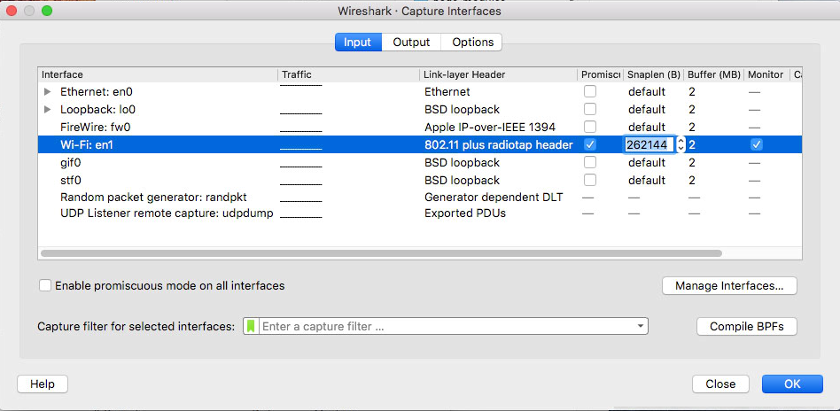
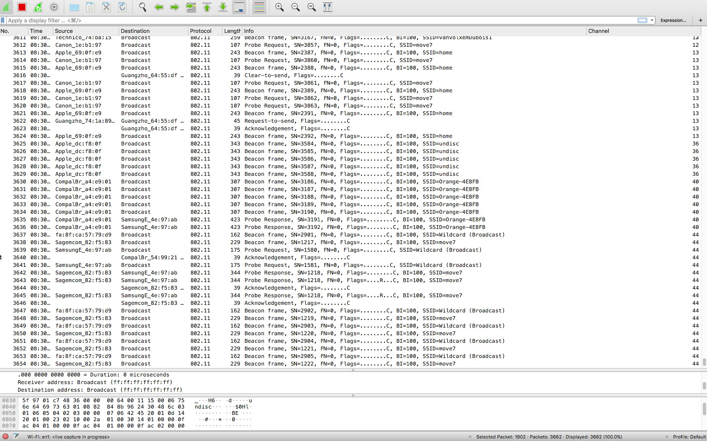

# channelhop
Wifi channel hopping script for use with wireshark and other net pcap capture utlities. Designed for macos and apple airport network cards.

-initial version still bare bone. defenetely no bells and wistles-

What is it: sript that will automatically change wifi channel while capturing datat with a tool like Wireshark. This is quiet handy during initial discovery when you need to assess all the networks that are available.

With this tool you can scan all networks in the area and not just those one one channel. 

❗Note that hopping channels inherently means you will loose data from any network conversation. This is therefore only useful when you're interested in who's out there NOT for when you want to know what is being exchanged. 


## functionality:
 * Uses the apple `airport` tool that comes standard with macos. This means that this tool is only useful for apple's wifi adaptors.
 * Will test for the wifi card's capabilities by trying out each wifi channel to see which ones it can use.
 * Test result provides a list of wifi channels that is then used for wifi hopping 
 * For now hopping is pre-configured to occur every 0.5 second and this 5000 times. (press CTRL-C to exit)


Feel free to fork and edit. I'll add functionality as I use it more

## remarks:
 * script assumes network card is already in __monitor__ mode!!!
 * assumes only 1 wifi adaptor is present
 * Interval should not be higher then 1 second. Wireshark will appear as if it's not switching channels because it does not have enough data to send typically in a longer interval
 * Same topic, it helps to increase wireshark data buffer and capture size

## How to use with Wireshark

 1. start wireshark (sudo is not needed)
 2. if you previously launched the script or did anything else with your airpor card turn it off and on again from the menu bar for instance. Sometimes wireshark will otherwise not receive any data.
 3. start capturing data, default settings are fine normally with high enough buffer and capture:# channelhop
Wifi channel hopping script for use with wireshark and other net pcap capture utlities. Designed for macos and apple airport network cards.

-initial version still bare bone. defenetely no bells and wistles-

What is it: sript that will automatically change wifi channel while capturing datat with a tool like Wireshark. This is quiet handy during initial discovery when you need to assess all the networks that are available.


## functionality:
 * Uses the apple `airport` tool that comes standard with macos. This means that this tool is only useful for apple's wifi adaptors.
 * Will test for the wifi card's capabilities by trying out each wifi channel to see which ones it can use.
 * Test result provides a list of wifi channels that is then used for wifi hopping 
 * For now hopping is pre-configured to occur every 0.5 second and this 5000 times. (press CTRL-C to exit)
 * Will check for the airport tool and create a symlink to it under `/usr/local/bin` which is typically included in your env $PATH so that you can launch it from anywhere.
 * Checks if script is being launched as __sudo__ which is required for the airport tool.


Feel free to fork and edit. I'll add functionality as I use it more

## remarks:
 * script assumes network card is already in __monitor__ mode!!!
 * assumes only 1 wifi adaptor is present
 * Interval should not be higher then 1 second. Wireshark will appear as if it's not switching channels because it does not have enough data to send typically in a longer interval
 * Same topic, it helps to increase wireshark data buffer and capture size
 * Commented out channels above 104. Even though my airport card supports some of them either the os or wireshark doesn't. ❔Does anyone know where this limitation sits? Just uncommment is you want ot try all channels.

## How to use with Wireshark

 1. start wireshark (sudo is not needed)
 2. if you previously launched the script or did anything else with your airpor card turn it off and on again from the menu bar for instance. Sometimes wireshark will otherwise not receive any data.
 3. start capturing data, default settings are fine normally with high enough buffer and capture size.
   
 4. launch the script from a terminal as __sudo__ by typing:  
 ````bash
 sudo ./channelhop.sh
 ````
 this should output something like this:
 ```
 $ /Volumes/nstephane/Dev/Command_line/channelhop.sh
check: running as sudo. ok.
check: airport util shortcut exists. ok.
Testing 5GHz - list C
Available channels: 19
1 2 3 4 5 6 7 8 9 10 11 12 13 36 40 44 48 100 104
hopping every 0.5 seconds, 4974 times left, current channel: 8
```
 5. In wireshark you should start to see the channel hopping like in this screenshot:  
 

 In case you have't done so already you might want to add a column in wireshark to display the channel. The field for this is `wlan_radio.channel` 